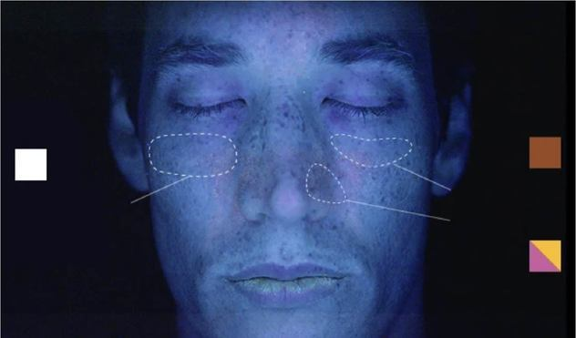

# Skin Type Detection System



This project is an advanced **Skin Type Detection System** that utilizes **OpenCV**, **FaceMesh Detection**, and **Machine Learning Models** to predict skin types in real-time. By analyzing video input from a webcam, the system determines the user's skin type (Normal, Oily, Dry, or Combination) and provides percentage-based predictions.

---

## Features

- **Real-Time Detection**: Predicts skin type using live webcam input.
- **FaceMesh Integration**: Uses FaceMesh to accurately identify facial features and calculate distance.
- **Aspect Ratio Management**: Maintains a 9:16 aspect ratio for better UI compatibility.
- **Prediction Averaging**: Computes averages over time for stable predictions.

---

## Code Overview

### 1. **Main Script**
The main script initializes the webcam, processes the video input, detects the user's face using FaceMesh, calculates the distance of the face, and predicts the skin type if the distance is within the desired range.

#### Example Code: Real-Time Detection

```python
import cv2
from cvzone.FaceMeshModule import FaceMeshDetector

# Initialize the webcam and FaceMesh detector
cap = cv2.VideoCapture(1)
detector = FaceMeshDetector(maxFaces=1)

while True:
    ret, frame = cap.read()
    if not ret:
        print("Failed to capture image")
        break

    frame = cv2.flip(frame, 1)
    frame, faces = detector.findFaceMesh(frame, draw=False)

    if faces:
        face = faces[0]
        # Logic for face analysis and prediction...
    
    cv2.imshow("Webcam", frame)
    if cv2.waitKey(1) & 0xFF == ord('q'):
        break

cap.release()
cv2.destroyAllWindows()
```

---

### 2. **Prediction Logic**

The `predict_image` function calls the **RoboFlow Model** to infer skin type from images. Predictions include confidence values for each skin type.

#### Example Code: Predicting Skin Type

```python
from prediction import predict_image

# Example prediction from an image
image_path = "path/to/image.jpg"
predictions = predict_image(image_path)
print(f"Predicted Skin Types: {predictions}")
```

---

### 3. **Window Management**

Maintains a 9:16 aspect ratio for the webcam window, resizing dynamically to ensure consistency across devices.

#### Example Code: Aspect Ratio Management

```python
def resize_window_aspect_ratio(window_name, width, height):
    """Maintains a 9:16 aspect ratio."""
    aspect_ratio = 9 / 16
    new_height = int(width / aspect_ratio)
    cv2.resizeWindow(window_name, width, new_height)
```

---

### 4. **Prediction Averaging**

Computes average percentages for each skin type over a specified duration to provide smoother and more reliable results.

#### Example Code: Averaging Predictions

```python
def average_percentages(data, duration=5, interval=1):
    """Calculates average percentages for predictions."""
    start_time = time.time()
    combined_skin_list, normal_skin_list, dry_skin_list, oily_skin_list = [], [], [], []

    while time.time() - start_time < duration:
        if 'combined' in data:
            combined_skin_list.append(data['combined'])
        # Similarly for other skin types...

    # Calculate averages and normalize to percentages
    avg_combined = sum(combined_skin_list) / len(combined_skin_list) if combined_skin_list else 0
    return avg_combined, avg_normal, avg_dry, avg_oily
```

---

## Setup Instructions

1. **Install Dependencies And Look In requirements.txt**:

   ```bash
   pip install opencv-python-headless cvzone roboflow
   ```

2. **Set API Key**:
   Update the RoboFlow API key in `os.environ["ROBOFLOW_API_KEY"]`.

3. **Run the Script**:

   ```bash
   python main.py
   ```

---

## Future Enhancements

- **Multi-Camera Support**: Add support for multiple camera sources.
- **GUI Integration**: Enhance user interaction using PyQt or Tkinter.
- **Mobile Support**: Extend functionality for mobile devices.

---

## Contribution

Feel free to contribute by forking the repository, making changes, and submitting pull requests. For issues or suggestions, open an issue on the GitHub repository.

Enjoy detecting your skin type with precision!
